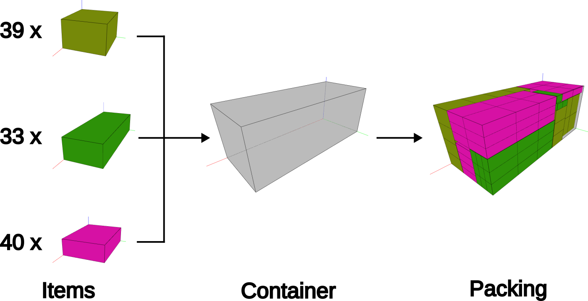
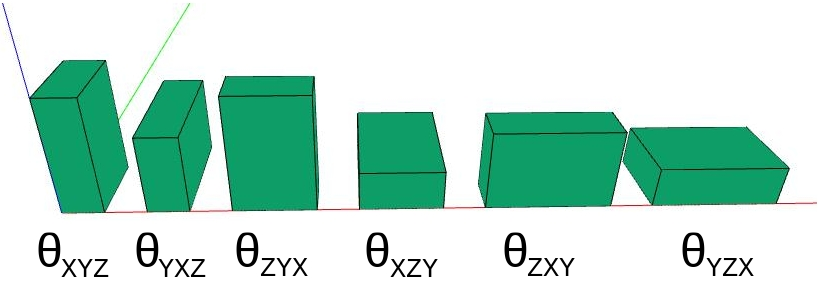
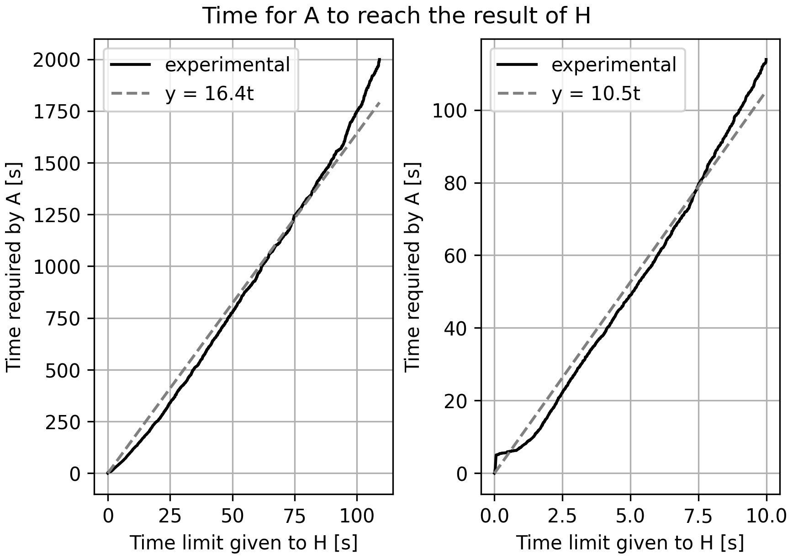
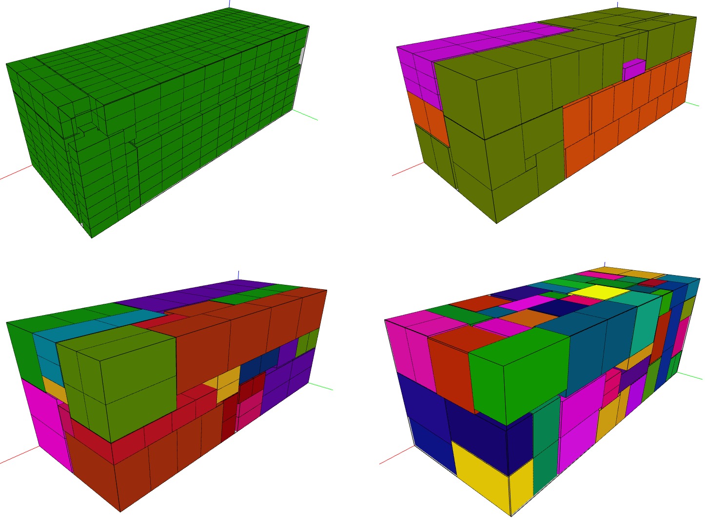

+++
title = "3D SCLP"
description = "A tree search-based heuristic for the three-dimensional single container loading problem (Master's thesis)"
weight = 2

[taxonomies]
tags = ["Combinatorial Optimization", "Heuristic", "Open Source"]

[extra]
local_image = "projects/sclp/packing.png"
+++

This is the project presented to the Institute of Computing of the University of Campinas in partial fulfillment of the requirements for the degree of Master of Science in Computer Science. I presented it to an evaluation committee on February 19th, 2025. You can watch it in the [presentation section](#presentation)

## History

After I graduated in Mechanical Engineering, I started working at [JettaCargo](https://jettacargo.com.br/en) with logistic optimizations. It was challenging to work on a topic I had no previous experience. Nevertheless, I did some amazing work that I am very proud of.

However, after some time there, I noticed I had too many gaps in my knowledge. Though I was studying and learning with my colleagues, something was odd. I felt like I was missing something. So, I decided I would look for it. How? I searched the internet for good universities in Brazil on Operations Research and I found [Unicamp](https://unicamp.br/), more specifically I found the [Laboratory of Optimization and Combinatorics (LOCo)](https://www.loco.ic.unicamp.br/), a large research group dedicated to solving the problems that I was interested.

I joined Unicamp to pursue a Master's in Computer Science, hoping to fill the gaps in my knowledge. I chose [Professor Flávio Keidi Miyazawa](https://ic.unicamp.br/~fkm/) to be my supervisor because, among the professors of Unicamp, he was the one most aligned with my research interest: three-dimensional packing problems. Later on, [Professor Thiago Alves de Queiroz](https://sites.google.com/ufcat.edu.br/taq/) joined as co-advisor.

## Problem Definition

From the beginning, I made it clear I wished to study and solve a three-dimensional single container packing problem, mostly because that was the main problem we solved at JettaCargo. The question was then which practical constraints we would add to the base problem. After extensive research and study, we decided to impose no practical constraint and beat the current state-of-the-art algorithm. We are audacious!

In simple terms, the problem is defined by a set of Items and a Container. Both the items and the container are [rectangular cuboids](https://en.wikipedia.org/wiki/Rectangular_cuboid). The items have a quantity (the number of that item that is available for allocating). Furthermore, each item has a set of up to six allowed orientations, meaning one can rotate them when allocating.

<figure>
    
    <figcaption>Illustration of the 3D-SCLP. Three types of Items are packed inside a Container, generating a Packing. Both the container and the items are rectangular cuboids.</figcaption>
</figure>

<figure>
    
    <figcaption>The six possible orientations of an item with length equals 10, width equals 20, and height equals 30, in the order &theta;xyz, &theta;xzy, &theta;yxz, &theta;yzx, &theta;zxy, and &theta;zyx. Each item has its own subset of allowed orientations.</figcaption>
</figure>

## Previous Works

In the last few years, many authors proposed solutions for the 3D-SCLP. Below I listed some of them with their main contributions and also the results reported by the authors. References can be found in the [References Section](#references).

During the research, Araya et al. (2017) was the state-of-the-art, obtaining an average volume usage of `95.53%` with a time limit of 30 seconds.

- **PE-08** - Parreño et al. (2008): compare the partition and cover representation for the residual space, they show that the latter yields better results;
- **FB-10** - Fanslau and Bortfeldt (2010): propose a tree search-based heuristic to solve the problem, that is the basis of all subsequent tree search-based proposals;
- **GR-12** - Goncalves and Resende (2012): propose successful a Biased Random-Key Genetic Algorithms (BRKGA) for the 3D-SCPL;
- **ZE-12** - Zhu et al. (2012): simplified and improved the tree search-based heuristic of Fanslau and Bortfeldt (2010);
- **ZH-12** - Zhang et al. (2012): poposed the use of the contact surface to select blocks;
- **AR-14** - Araya and Riff (2014): expanded the tree search-based heuristic of Zhu et al. (2012) to a beam search;
- **RA-16** - Ramos et al. (2016): expanded the BRKGA algorithm of Goncalves and Resende (2012);
- **AA-17** - Araya et al. (2017): modified the evaluation function of Araya and Riff (2014);

| Heuristic | Volume Usage | Time Limit [s] |
|-----------|--------------|----------------|
| PE-08     | 91.05        | 100            |
| FB-10     | 93.88        | 320            |
| GR-12     | 94.54        | 147-p          |
| ZE-12     | 94.59        | 500            |
| ZL-12     | 94.98        | 500            |
| ZH-12     | 94.53        | 600            |
| AR-14     | 95.40        | 500            |
| RA-16     | 94.71        | 274-p          |
| AA-17     | 95.53        | 30             |

<figcaption>Comparison of the results reported by different heuristics of the literature. The `-p` in the time limit indicates parallel execution.</figcaption>

## Proposed Heuristic

We reproduced the state-of-the-art with our own code implementation and proposed the improvements below.

### Data Structures

To implement the residual space, the state-of-the-art uses linked lists while we use data structures with contiguous memory layout. To find the contact area between blocks, the state-of-the-art used the external library [Bullet](https://github.com/bulletphysics/bullet3), which relies on collision detection methods, while we used a broad and narrow search technique combined with a contiguous memory storage.

### Memoization

We added a mechanism that avoids recomputations.

### Volume Loss Estimate

We used a different function to estimate the amount of volume lost when a block is allocated in an empty space.

### Configuration

Both our and the state-of-the-art heuristics require the specification of parameters. To find good values, the state-of-the-art performed a manual search while we used [irace](https://www.rdocumentation.org/packages/irace/) for automatic algorithm configuration.

### Evaluation Function

We used a two-stage modification of the fitness function proposed by the state-of-the-art, allowing the heuristic to adapt and change its behavior at different phases of the allocation process.

## Results

### Average Volume Usage

The heuristic we proposed, with only 5 seconds (5-H), outperformed the state-of-the-art (AA-17) with 30 seconds by <code>0.11%</code>. With 30 seconds (30-H), it outperformed the state-of-the-art by <code>0.52%</code>

| Heuristic | Volume Usage | Time Limit |
|-----------|--------------|------------|
| AA-17     | 95.53        | 30         |
| 5-H       | 95.64        | 5          |
| 30-H      | 96.05        | 30         |

<figcaption>Comparison of the results obtained with different time limits using state-of-the-art (AA-17) and the proposed heuristic with a time limit of 5 seconds (5-H) and 30 seconds (30-H).</figcaption>

### Time Equivalence

The figure below presents the time required by state-of-the-art (A) to reach the results of the proposed heuristic (H). The full black line shows the experimental result. Because of its apparent linear behavior, we made a linear curve fit <code>f(t) = &alpha; &centerdot; t</code> to identify the angular coefficient <code>&alpha;</code>. The results demonstrate that **H performs as well as A with one-sixteenth of the time**. In other words, given a time limit <code>T</code> to heuristic H, it would take <code>16&centerdot;T</code> for A to reach the same result.

<figure>
    
    <figcaption>Time required for state-of-the-art (A) to reach the results of the proposed heuristic (H). On the left, the time required by A is limited to 2000 seconds. On the right, the time limit given to H is limited to 10 seconds. In full black line, the experimental data. In gray dashed lines, a curve fit of the function <code>f(t) = &alpha; &centerdot; t</code>. The value of <code>&alpha;</code> is displayed in each graph.</figcaption>
</figure>

### Packings

Some solutions, i.e. packings, are displayed below.

<figure>
    
    <figcaption>Four packings. On the top left, a homogeneous packing (one item type). On the top right, a weakly heterogeneous packing (3 item types). On the bottom left and right, two strongly heterogeneous packings (many item types).</figcaption>
</figure>

## Presentation

<video controls>
    <source src="masters_presentation_lucasguesserts.webm" type="video/webm">
    Sorry, it seems that your browser does not support playing videos.
</video>

## Conclusion

Joining LOCo was the right choice. I developed a cool work and I was able to outperform the current state-of-the-art algorithm of the 3D-SCLP. I also came into contact with many different topics, solution techniques, and people, further expanding my knowledge of Algorithms, Combinatorial Optimization, and Operations Research. I am grateful for the supervision of Flávio and Thiago and all the people who were part of my journey.

We made a nice work and obtained very good results! We intend to publish a paper and open-source the code.

## References

### Scientific Articles

- [Araya, I., Guerrero, K., & Nuñez, E. (2017). VCS: A new heuristic function for selecting boxes in the single container loading problem. Computers & Operations Research, 82, 27-35.](https://doi.org/10.1016/J.COR.2017.01.002)
- [Araya, I., Moyano, M., Arielo, Lobo, B., Emiliano, & Guesser, L. (2017). Metasolver.](https://github.com/rilianx/Metasolver)
- [Araya, I., & Riff, M. C. (2014). A beam search approach to the container loading problem. Computers & Operations Research, 43, 100-107.](https://doi.org/10.1016/j.cor.2013.09.003)
- [Fanslau, T., & Bortfeldt, A. (2010). A Tree Search Algorithm for Solving the Container Loading Problem. INFORMS Journal on Computing, 22, 222-235.](https://doi.org/10.1287/ijoc.1090.0338)
- [Gonçalves, J. F., & Resende, M. G. C. (2012). A parallel multi-population biased random-key genetic algorithm for a container loading problem. Computers & Operations Research, 39, 179-190.](https://doi.org/10.1016/j.cor.2011.03.009)
- [Parreño, F., Alvarez-Valdés, R., Tamarit, J. M., & Oliveira, J. F. (2008). A Maximal-Space Algorithm for the Container Loading Problem. INFORMS Journal on Computing, 20, 412-422.](https://doi.org/10.1287/ijoc.1070.0254)
- [Ramos, A. G., Oliveira, J. F., Gonçalves, J. F., & Lopes, M. J. P. (2016). A container loading algorithm with static mechanical equilibrium stability constraints. Transportation Research Part B-Methodological, 91, 565-581.](https://doi.org/10.1016/J.TRB.2016.06.003)
- [Zhang, D., Peng, Y., & Leung, S. C. H. (2012). A heuristic block-loading algorithm based on multi-layer search for the container loading problem. Computers & Operations Research, 39, 2267-2276.](https://doi.org/10.1016/j.cor.2011.10.019)
- [Zhu, W., & Lim, A. (2012). A new iterative-doubling Greedy-Lookahead algorithm for the single container loading problem. European Journal of Operational Research, 222, 408-417.](https://doi.org/10.1016/j.ejor.2012.04.036)
- [Zhu, W., Oon, W.-C., Lim, A., & Weng, Y. (2012). The six elements to block-building approaches for the single container loading problem. Applied Intelligence, 37, 431-445.](https://doi.org/10.1007/s10489-012-0337-0)

### Links

- [JettaCargo](https://jettacargo.com.br/en) ([linkedin](https://www.linkedin.com/company/jettacargo/) and [internet archive](https://web.archive.org/web/20250318184754/https://jettacargo.com.br/en))
- [Unicamp](https://unicamp.br/) ([internet archive](https://web.archive.org/web/20250318185508/https://unicamp.br/))
- [Laboratory of Optimization and Combinatorics](https://www.loco.ic.unicamp.br/) ([internet archive](https://web.archive.org/web/20250318185609/https://www.loco.ic.unicamp.br/))
- [Professor Flávio Keidi Miyazawa, Ph.D.](https://ic.unicamp.br/~fkm/) ([CV Lattes](http://buscatextual.cnpq.br/buscatextual/visualizacv.do?id=K4796550E9), [internet archive](https://web.archive.org/web/20250318190856/https://ic.unicamp.br/~fkm/))
- [Professor Thiago Alves de Queiroz, Ph.D.](https://sites.google.com/ufcat.edu.br/taq/) ([CV Lattes](http://lattes.cnpq.br/8041183668335400), [ORCID](https://orcid.org/0000-0003-2674-3366), [Linkedin](https://www.linkedin.com/in/taq-ufcat/), [internet archive](https://web.archive.org/web/20250318191708/https://sites.google.com/ufcat.edu.br/taq/))
- [Bullet Physics SDK](https://github.com/bulletphysics/bullet3)
- [irace: Iterated Racing for Automatic Algorithm Configuration](https://www.rdocumentation.org/packages/irace/)
